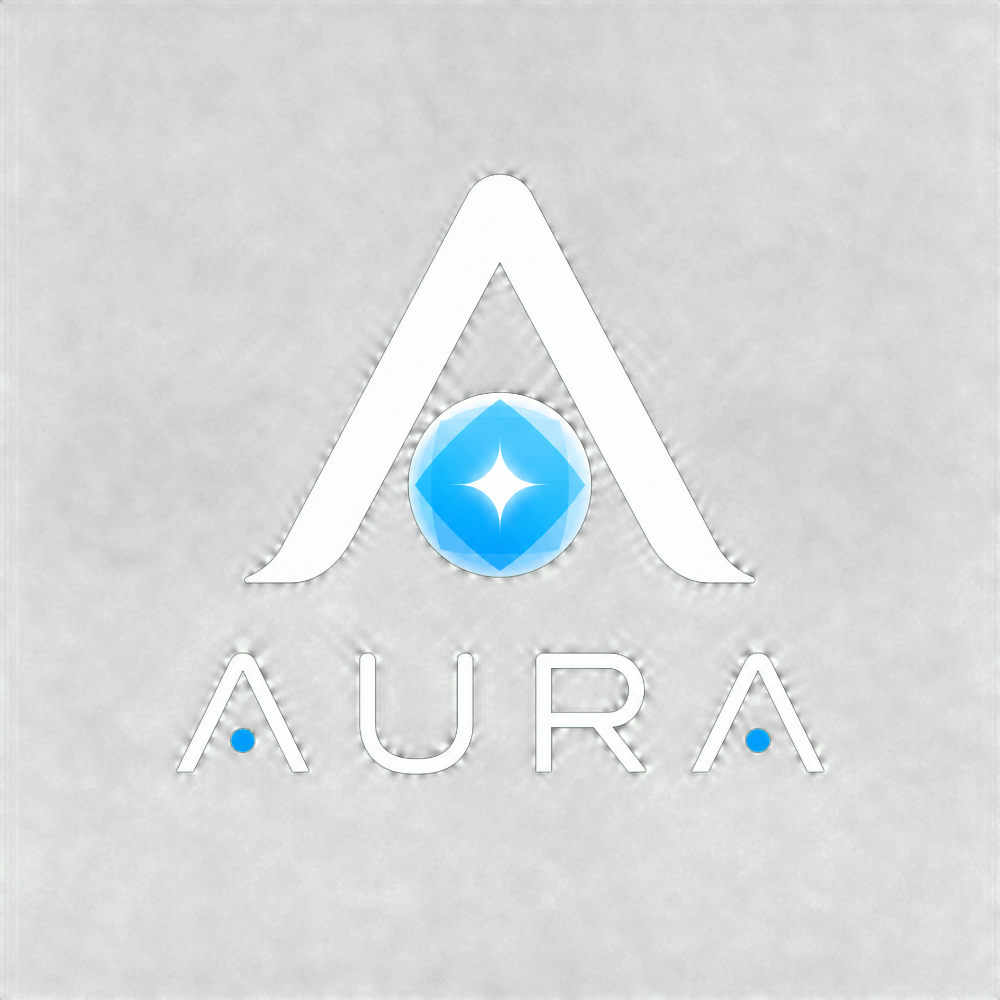

# Aura AI Assistant

**Aura** is a premium, minimalist AI assistant designed to be your intelligent presence. Built with a focus on performance, aesthetics, and user privacy, Aura integrates powerful AI capabilities with real-time contextual awareness, all within a beautiful and responsive user interface.

## ✨ Features

*   **Dual AI Engine Support:** Seamlessly switch between:
    *   **Google Gemini API:** Leverage Google's advanced AI models with your own API key (BYOK - Bring Your Own Key) for secure and personalized interactions.
    *   **Ollama Integration:** Connect to your local Ollama instance to utilize open-source large language models (LLMs) like Llama 3, Mistral, and Phi-3, ensuring privacy and offline capability.
*   **Real-time Contextual Awareness:** Aura intelligently injects your environment details into AI prompts, including:
    *   Browser information
    *   Screen resolution
    *   Local timezone
    *   Battery status
    *   Online/offline status
    *   Current date and time
*   **Personalized Persona:** Define your name, a brief description about yourself, and Aura's desired tone/persona in the settings. This information is used to tailor AI responses to your preferences.
*   **OpenWeather Integration:** Get real-time weather updates for your specified city, configurable with your OpenWeather API key.
*   **Voice Input & Text-to-Speech (TTS):** Interact with Aura using your voice and receive spoken responses for a natural conversational experience.
*   **Persistent Settings:** All your configurations, including API keys (stored locally only), user profile, and appearance preferences, are saved securely in your browser's local storage.
*   **Responsive & Aesthetic UI:**
    *   **Lighthearted White & Sky Blue Theme:** A clean, modern design with subtle grain textures and animated radial gradients.
    *   **Typography:** Elegant `Instrument Serif` for headings and clear `Poppins` for body text.
    *   **Glass-morphism:** Frosted glass effects on widgets and panels.
    *   **Smooth Animations:** Fluid transitions and a cinematic boot sequence.
*   **Progressive Web App (PWA):** Install Aura directly to your device for an app-like experience.

## 🚀 Getting Started

To run Aura locally, simply open the `index.html` file in your web browser. No build steps or server-side dependencies are required.

### ⚙️ Configuration

All configurations are managed through the **Settings Panel** within the Aura application. Access it by clicking the gear icon in the top right corner.

#### 🔑 API Keys (BYOK - Bring Your Own Key)

*   **Gemini API Key:** Obtain your key from [Google AI Studio](https://aistudio.google.com/app/apikey).
*   **OpenWeather API Key:** Get a free key from [OpenWeatherMap](https://openweathermap.org/api).

**Important:** Your API keys are stored **only in your browser's local storage** and are never transmitted to any server other than the respective API endpoints (Google Gemini, OpenWeather, or your local Ollama instance). Aura is designed for client-side operation, ensuring maximum privacy for your sensitive credentials.

#### 🌐 Ollama Setup

To use Ollama, you need to have it running locally on your machine. Download and install Ollama from [ollama.com](https://ollama.com/). Once installed, you can pull models (e.g., `ollama run llama3`) and then configure the local endpoint (e.g., `http://localhost:11434`) and model name in Aura's settings.

## 🔒 Security Considerations

*   **Client-Side Operation:** Aura operates entirely client-side, meaning your data and API keys remain on your device.
*   **Content Security Policy (CSP):** `index.html` includes a robust CSP to mitigate cross-site scripting (XSS) and other content injection attacks.
*   **Input Sanitization:** All user inputs are sanitized to prevent malicious code injection.
*   **BYOK Principle:** You are responsible for your API keys. Aura provides the mechanism to use them securely from your browser.

## 📈 SEO & Accessibility

*   **Semantic HTML5:** Structured content for better search engine understanding and accessibility.
*   **Meta Tags:** Comprehensive meta descriptions, keywords, and Open Graph/Twitter Card data for improved search visibility and social sharing.
*   **ARIA Attributes:** Extensive use of ARIA roles and attributes to enhance accessibility for users with assistive technologies.
*   **PWA Manifest:** Enables installation as a Progressive Web App, improving user engagement and discoverability.

## 🎨 Design & Technology Stack

*   **Core:** Pure HTML5, CSS3, and modern Vanilla JavaScript (ES6+).
*   **Dependencies (via CDN):**
    *   [Lenis Scroll](https://lenis.darkroom.engineering/) for smooth scrolling.
    *   [Lucide Icons](https://lucide.dev/) for clean UI iconography.
*   **Fonts:** `Instrument Serif` and `Poppins` from Google Fonts.

## 🤝 Contributing

Contributions are welcome! Feel free to fork the repository, make improvements, and submit pull requests. Please ensure your code adheres to the existing style and conventions.

## 📄 License

This project is licensed under the MIT License. See the [LICENSE](LICENSE) file for details.

---

*Built with ❤️ by Manus AI and contributors.*
